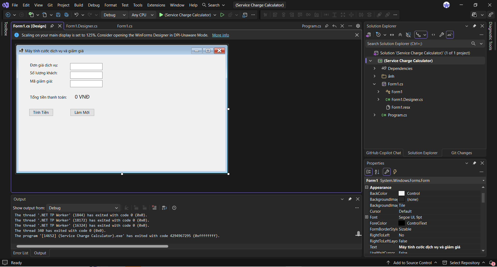
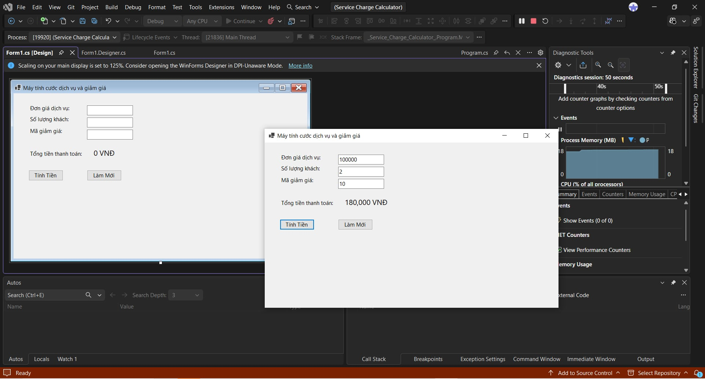
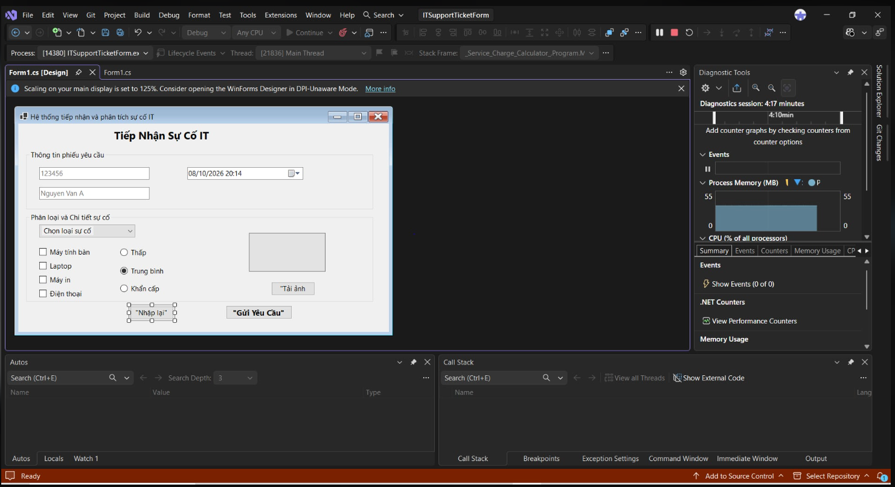
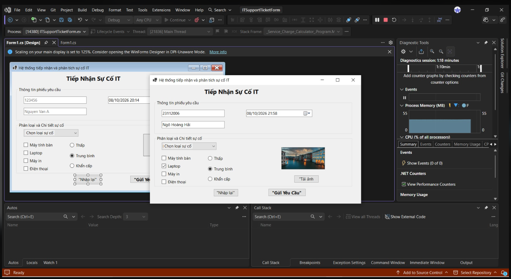
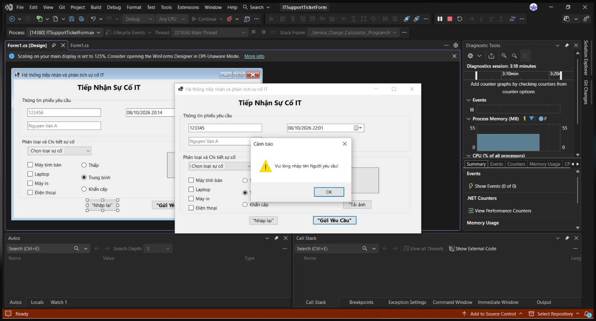

# BÁO CÁO BÀI TẬP / ĐỒ ÁN

## THÔNG TIN SINH VIÊN
- **Họ và tên:** Đoàn Thành Đạt
- **Mã số sinh viên:** 24810320056
- **Lớp:** D19QTANM!
- **Tên môn học:** Lập trình .NET / Windows Forms
- **Tên bài tập:** Bài 1: Máy tính tính cước dịch vụ & Giảm giá (Service Charge Calculator)

---

## KẾT QUẢ THỰC HÀNH

### Bai 1

### 1. Ảnh màn hình Giao diện chính

### 2. Ảnh màn hình Chức năng thực thi / Kết quả

### 3. Ảnh màn hình Kiểm tra lỗi (Validation)

### Bai 2

### 1. Ảnh màn hình Giao diện chính

### 2. Ảnh màn hình Chức năng thực thi / Kết quả

### 3. Ảnh màn hình Kiểm tra lỗi (Validation)

